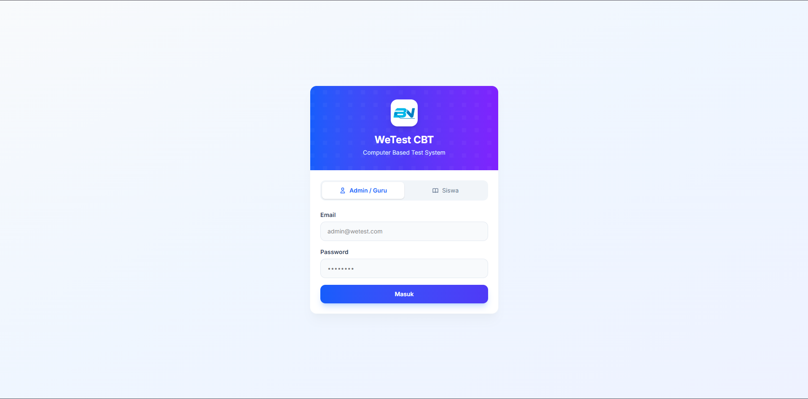
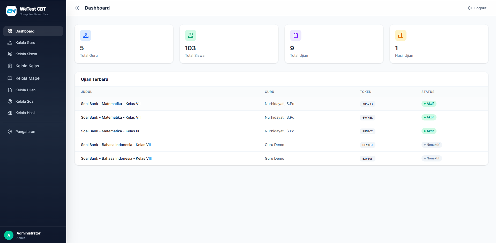
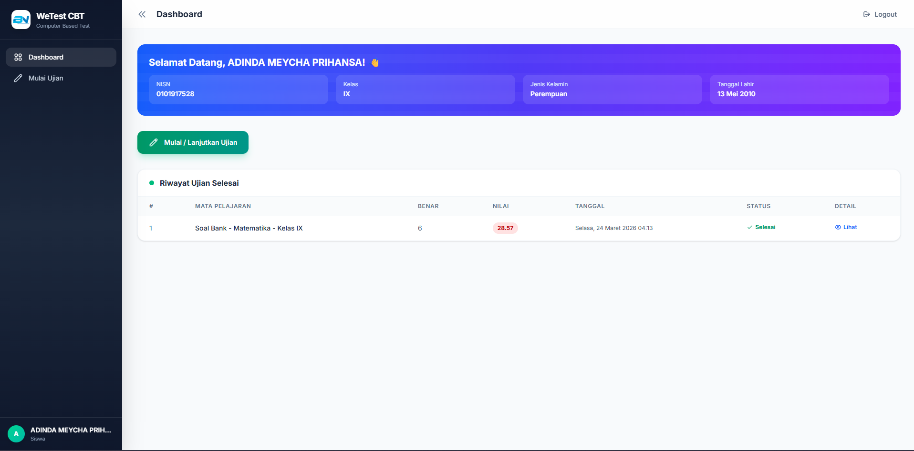
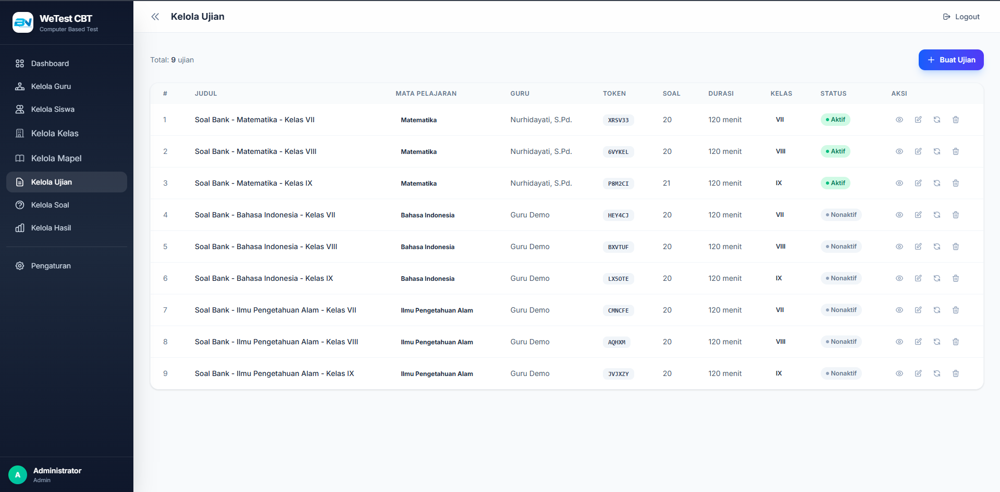
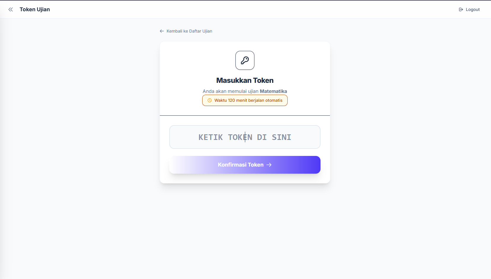
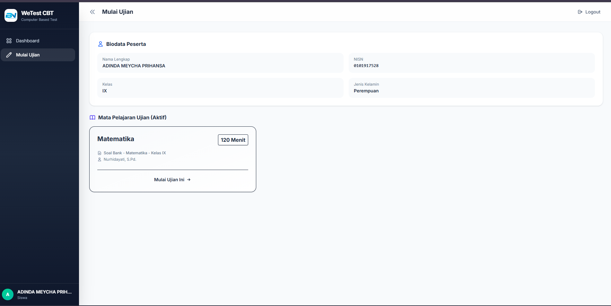
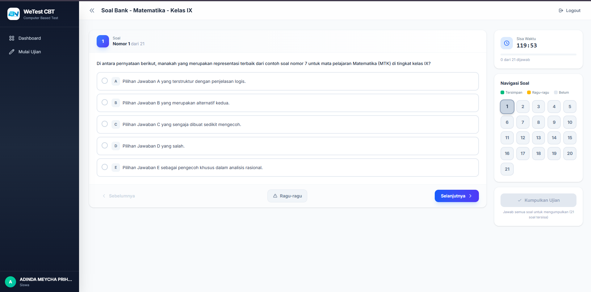
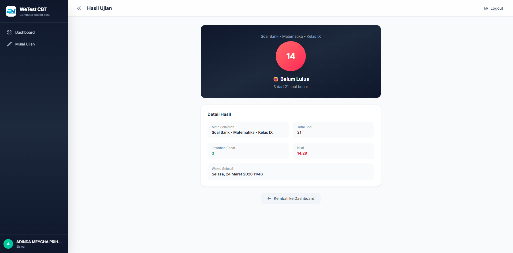

# WeTest CBT (Computer Based Test)

Sistem ujian berbasis komputer (CBT) yang dibangun dengan **Laravel 12**. Mendukung tiga peran pengguna: **Admin**, **Guru**, dan **Siswa** dengan fitur ujian real-time, monitoring live, dan manajemen soal lengkap.

## ✨ Fitur Utama

### 🔐 Multi-Role Authentication
- **Admin** — Kelola guru, siswa, ujian, soal, dan hasil ujian
- **Guru** — Kelola soal untuk ujian yang diampu
- **Siswa** — Mengerjakan ujian, melihat hasil, dan melanjutkan sesi

### 📝 Manajemen Ujian
- CRUD ujian dengan token akses otomatis
- Pengelompokan ujian per kelas (VII, VIII, IX)
- Durasi ujian yang dapat dikonfigurasi
- Regenerate token ujian
- Soal mendukung teks + gambar (pilihan A–E)

### 🎯 Fitur Ujian Siswa
- Tampilan soal satu per halaman dengan navigasi grid
- Acak urutan soal (setiap siswa mendapatkan urutan berbeda)
- Auto-save jawaban secara real-time (AJAX)
- Tombol **Ragu-ragu** dengan penanda warna kuning
- Tombol **Kumpulkan** disabled hingga semua soal dijawab
- Timer countdown dengan indikator visual
- Auto-submit saat waktu habis
- **Resume sesi** — jika siswa logout/keluar, login kembali dan masukkan token untuk melanjutkan

### 📊 Monitoring Admin
- Live monitoring siswa yang sedang mengerjakan ujian
- Progress bar per siswa (jumlah dijawab, sisa, %)
- Status: 🔴 Sedang Mengerjakan / 🟢 Selesai
- CRUD hasil ujian

### ⚙️ Pengaturan
- Ubah nama website dan logo
- Favicon dinamis dari logo yang diupload
- GitHub Token management
- Clear Cache & Clear Config
- Log viewer

### 🖼️ Optimasi Gambar
- Semua gambar soal otomatis dikonversi ke **WebP** (kualitas 90%)
- Maksimal upload 500KB
- Logo tetap format asli (tidak dikonversi)

---

## 📋 Persyaratan Sistem

- **PHP** >= 8.2 (dengan ekstensi GD)
- **Composer** >= 2.x
- **Node.js** >= 18.x & **NPM**
- **MySQL** >= 5.7 / MariaDB
- **XAMPP** atau web server lainnya

---

## 🚀 Langkah Instalasi

### 1. Clone Repository

```bash
git clone https://github.com/aangwie/we-cbt.git
cd we-cbt
```

### 2. Install Dependencies

```bash
composer install
npm install
```

### 3. Konfigurasi Environment

```bash
cp .env.example .env
php artisan key:generate
```

Edit file `.env` dan sesuaikan konfigurasi database:

```env
APP_NAME="WeTest CBT"
APP_URL=http://localhost:8000

DB_CONNECTION=mysql
DB_HOST=127.0.0.1
DB_PORT=3306
DB_DATABASE=wetest
DB_USERNAME=root
DB_PASSWORD=
```

### 4. Buat Database

Buat database baru di MySQL dengan nama `wetest` (atau sesuaikan dengan `.env`):

```sql
CREATE DATABASE wetest;
```

### 5. Jalankan Migrasi & Seeder

```bash
php artisan migrate
php artisan db:seed
```

### 6. Buat Symbolic Link untuk Storage

```bash
php artisan storage:link
```

### 7. Build Assets Frontend

```bash
npm run build
```

### 8. Jalankan Server

```bash
php artisan serve
```

Aplikasi dapat diakses di: **http://localhost:8000**

---

## 🖼️ Screenshot

### 1. Halaman Login


### 2. Halaman Dashboard Admin


### 3. Halaman Dashboard Siswa


### 4. Halaman Manajmen Ujian


### 5. Halaman Token Ujian


### 6. Halaman Monitoring Ujian


### 7. Halaman Ujian Aktif


### 8. Halaman Hasil Ujian



## 🔑 Cara Akses

### Admin
| Field    | Value              |
|----------|--------------------|
| URL      | `/login`           |
| Email    | `admin@wetest.com` |
| Password | `password`         |

### Guru
| Field    | Value             |
|----------|-------------------|
| URL      | `/login`          |
| Email    | *(dibuat oleh admin)* |
| Password | *(dibuat oleh admin)* |

### Siswa
| Field    | Value                     |
|----------|---------------------------|
| URL      | `/login`                  |
| NISN     | *(didaftarkan oleh admin)*|
| Password | *(didaftarkan oleh admin)*|

> **Catatan:** Akun default di atas tersedia jika menggunakan `DatabaseSeeder`. Sesuaikan dengan seeder yang digunakan.

---

## 📁 Struktur Proyek

```
we-cbt/
├── app/
│   ├── Helpers/          # ImageHelper (konversi WebP)
│   ├── Http/Controllers/ # AdminController, GuruController, SiswaController, dll
│   ├── Models/           # Ujian, Soal, Siswa, HasilUjian, SesiUjian, dll
│   └── Imports/          # SiswaImport (import Excel)
├── database/
│   ├── migrations/       # Skema database
│   └── seeders/          # Data awal
├── resources/views/
│   ├── admin/            # Halaman admin
│   ├── guru/             # Halaman guru
│   ├── siswa/            # Halaman siswa
│   └── layouts/          # Template layout
└── routes/web.php        # Definisi routing
```

---

## 🛠️ Perintah Berguna

```bash
# Development mode (hot reload)
npm run dev

# Build untuk production
npm run build

# Clear semua cache
php artisan cache:clear
php artisan view:clear
php artisan route:clear
php artisan config:clear

# Fresh migrate (reset database)
php artisan migrate:fresh --seed
```

---

## 📝 Tech Stack

| Teknologi    | Versi   |
|-------------|---------|
| Laravel     | 12.x    |
| PHP         | 8.2+    |
| Tailwind CSS| 4.x     |
| Alpine.js   | 3.x     |
| Vite        | 6.x     |
| SweetAlert2 | Latest  |
| MySQL       | 5.7+    |

---

## 📄 Lisensi

Proyek ini dilisensikan di bawah [MIT License](https://opensource.org/licenses/MIT).
